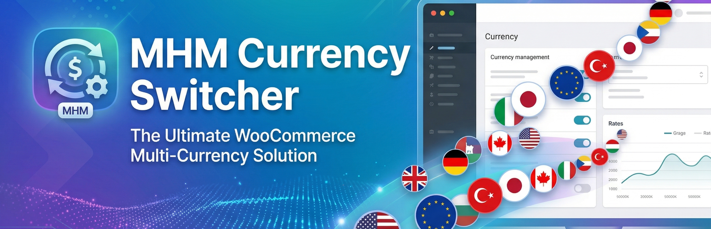
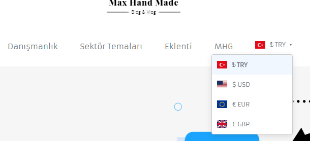
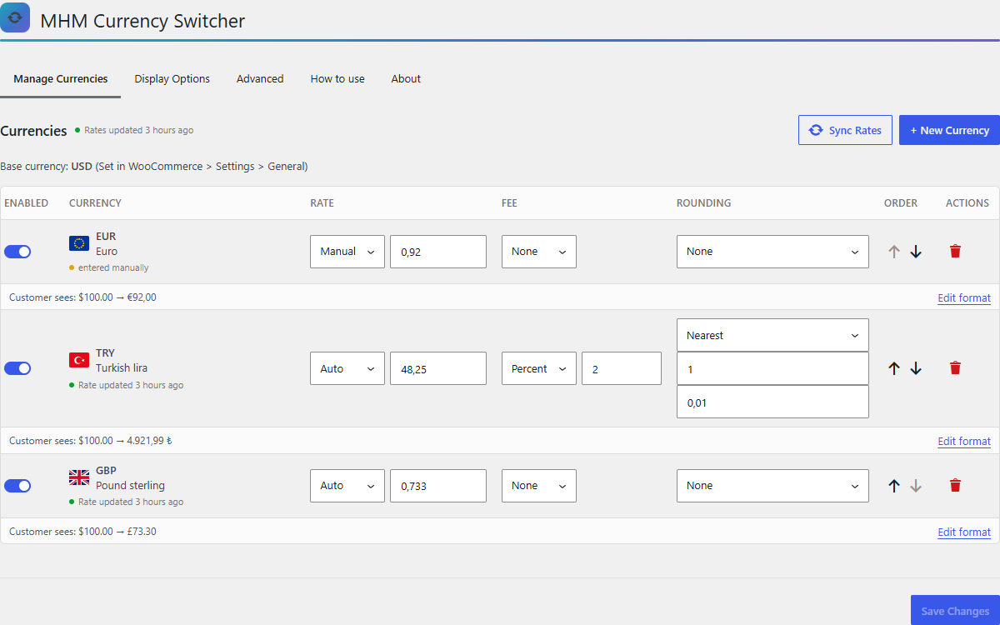
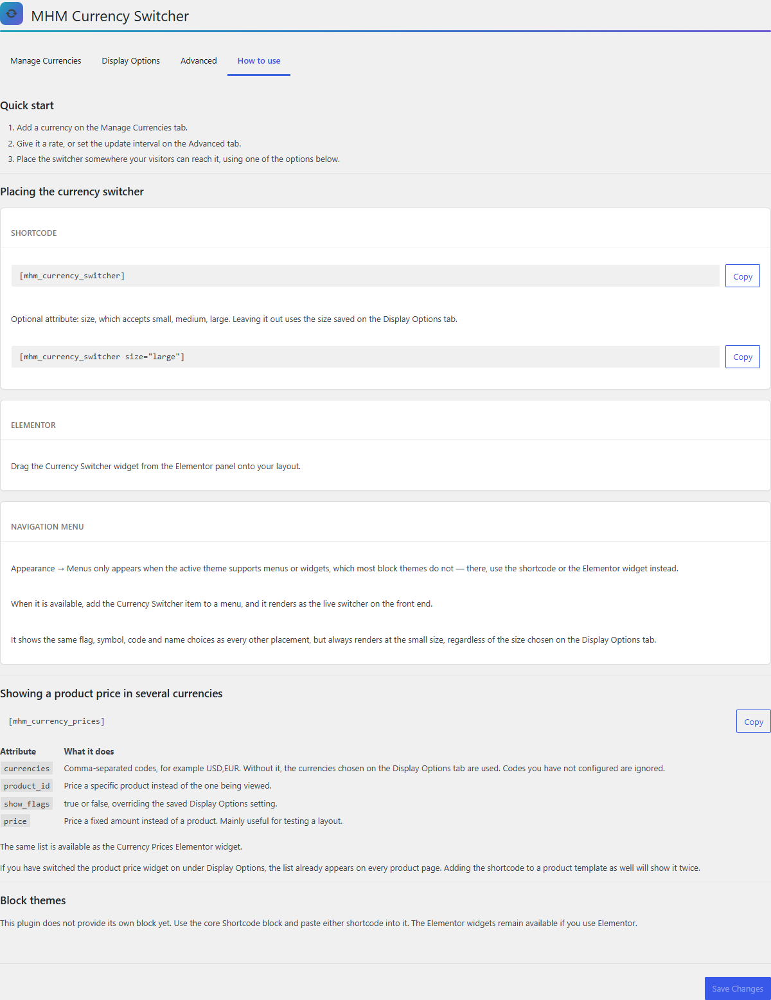
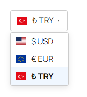
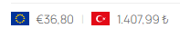

<p align="center">
  
</p>

<p align="center">
  <strong>English</strong> · <a href="README-tr.md">Türkçe</a>
</p>

<p align="center">
  
  
  
  
  
</p>

# MHM Currency Switcher

Multi-currency support for WooCommerce. Visitors browse, add to cart and check out
in the currency they choose, with exchange rates fetched automatically — and it
keeps working behind a page cache, which is where most currency switchers break.

## Contents

- [Why this plugin](#why-this-plugin)
- [Screenshots](#screenshots)
- [Requirements](#requirements)
- [Installation](#installation)
- [How to use](#how-to-use)
- [Shortcodes](#shortcodes)
- [WP-CLI](#wp-cli)
- [Cache compatibility mode](#cache-compatibility-mode)
- [Accepted limits](#accepted-limits)
- [Development](#development)
- [License](#license)

## Why this plugin

**It survives a page cache.** A page cache stores the HTML produced for whoever
asked first, so a plugin that converts prices on the server serves the first
visitor's currency to everyone after them. This plugin renders anonymous
catalogue pages in the shop's base currency — one cached copy, correct for
everybody — and the browser corrects the displayed prices afterwards. Cart,
checkout, order totals and order emails are always calculated on the server, so
the amount charged can never be changed from the browser.

Everything else follows from that decision:

| | |
|---|---|
| **Real exchange rates** | ExchangeRate-API, with a jsDelivr fallback if it is unreachable |
| **Per-currency control** | manual or automatic rate, a fee (fixed or percentage), and rounding rules, each currency on its own |
| **Fixed prices per product** | override the converted price for a specific product and currency |
| **Five ways to place the switcher** | two shortcodes, two Elementor widgets, or a navigation menu item |
| **Geolocation** | detect the visitor's country and preselect a matching currency |
| **283 flag icons** | SVG, bundled, no external requests |
| **Turkish included** | admin and storefront fully translated |
| **WP-CLI** | sync rates, inspect a currency, flush the cache, list what is configured |

## Screenshots

The switcher in a live shop's navigation menu, and a shop priced in US dollars
as a visitor sees it after choosing Turkish lira:

<p>
  
</p>

<p>
  
</p>

The settings screen — currencies, then display, then the rest:

<p>
  
</p>

<p>
  
</p>

## Requirements

- WordPress 6.6 or later
- WooCommerce 7.4 or later
- PHP 7.4 or later

WordPress 6.6 is a hard floor, not a guess: the settings screen is a React app
that depends on the `react-jsx-runtime` script handle, which WordPress core only
registers from 6.6. On 6.5 and below WordPress refuses the install.

## Installation

1. Copy the `mhm-currency-switcher` folder into `wp-content/plugins/`, or upload
   the release ZIP under **Plugins → Add New → Upload Plugin**.
2. Activate it from the **Plugins** screen.
3. Open **WooCommerce → MHM Currency** and add your first currency.

## How to use

Adding a currency does not put anything on your storefront — the switcher has to
be placed somewhere a visitor can reach it. The plugin's own **How to use** tab
lists every option with copyable code; in short:

| Where | How |
|---|---|
| Any post, page or text widget | the `[mhm_currency_switcher]` shortcode |
| Elementor | drag the **Currency Switcher** widget onto the layout |
| Navigation menu (themes that support menus or widgets) | **Appearance → Menus**, add the **Currency Switcher** item |
| Block themes | the core **Shortcode** block — this plugin does not provide its own block yet |
| A product page, in several currencies at once | the `[mhm_currency_prices]` shortcode, or the **Currency Prices** Elementor widget |

## Shortcodes

### `[mhm_currency_switcher]`

The dropdown a visitor picks a currency from.

| Attribute | Values | Default |
|---|---|---|
| `size` | `small`, `medium`, `large` | the size saved under Display Options |



### `[mhm_currency_prices]`

One product's price in several currencies at once.

| Attribute | What it does |
|---|---|
| `currencies` | comma-separated codes, e.g. `USD,EUR`. Without it, the currencies chosen under Display Options are used. Codes you have not configured are ignored. |
| `product_id` | price a specific product instead of the one being viewed |
| `show_flags` | `true` or `false`, overriding the saved Display Options setting |
| `price` | price a fixed amount instead of a product — mainly for testing a layout |



## WP-CLI

```bash
wp mhm-cs rates-sync          # fetch fresh exchange rates
wp mhm-cs rates-get EUR       # show the raw and effective rate for one currency
wp mhm-cs cache-flush         # drop the rate cache
wp mhm-cs currencies-list     # list configured currencies
wp mhm-cs status              # overview: base currency, rates, schedule
```

## Cache compatibility mode

On by default, under **WooCommerce → MHM Currency → Advanced**.

Anonymous shop, archive and product pages render in the base currency and the
browser converts the displayed prices through `POST /wp-json/mhmcs/v1/convert`.
The endpoint prices products the caller names, reading each amount on the server
— a browser cannot dictate a price. Cart, checkout, order totals, order emails
and the WooCommerce REST API are always converted server-side in the currency
the customer actually chose.

Turning the mode off makes the storefront convert on the server again, as it did
before the feature existed. Read the limits below before deciding either way:
both settings have consequences, and they are different ones.

## Accepted limits

Full explanations live in [readme.txt](readme.txt) under "Known limits". In short:

- **Off is not exactly the pre-1.1.0 behaviour.** Three fixes sit above the
  setting and stay either way: no conversion on admin screens or admin AJAX,
  `wc/v3` reads pinned to the base currency, no conversion under cron or WP-CLI.
- **Crawlers see base prices**, including the structured product data.
- **Base prices are visible from first paint** and are replaced when the request
  returns, each fading over 200ms; `prefers-reduced-motion` gets the swap
  without the fade.
- **No JavaScript, or an unreachable endpoint** → base prices stay, the reason
  goes to the browser console, nothing visible breaks.
- **Variable products** are forced onto WooCommerce's AJAX variation path, so
  `data-product_variations` is `false` and third-party swatch plugins that read
  prices out of that JSON may stop showing one.
- **The mini-cart** renders in base and is corrected by WooCommerce's cart
  fragment refresh. If fragments are dequeued the cached mini-cart stays in
  base; the plugin detects that and warns in the admin.
- **A cart or checkout on a page WooCommerce does not know about** must be
  excluded from your cache yourself.
- **`?currency=` multiplies cache entries.** The switcher does not generate such
  URLs — it sets a cookie and converts in place without reloading.
- **Logged-in visitors** convert server-side, which assumes your cache bypasses
  them. Verify that if you cache at the edge.
- **WooCommerce Analytics adds different currencies together.** An order placed
  in dollars is reported as its dollar figure under the base currency's symbol.

## Development

### Prerequisites

Composer, Node.js 18+, and Docker for the integration tests.

```bash
composer install
npm install && npm run build
```

### Gates

```bash
composer test              # PHPUnit, unit — no external dependencies
composer lint              # PHPCS
composer analyze           # PHPStan
npm run test:js            # Jest + jsdom, covers assets/js/
npm run lint:js            # ESLint
```

`npm run test:js` exists because `assets/js/` is the storefront's load-bearing
surface and no PHP gate can see it.

### Integration tests

They need a real WordPress + WooCommerce install. The one-command Docker runner
needs nothing but Docker and matches what CI does:

```bash
bin/test-integration-docker.sh                                    # WP latest
PHP_VERSION=7.4 WC_VERSION=9.1.4 bin/test-integration-docker.sh 6.6
```

It tests one WordPress/WooCommerce pair per run; CI runs three — PHP 7.4/WP
6.6/WC 9.1.4, PHP 8.1/WP 6.8/WC 9.8.5, PHP 8.2/WP latest/WC latest. The lowest
pair is pinned to the declared floor.

To verify the declared floor itself — which the test suite cannot, because it
never loads an admin page — build a ZIP and open it on that version:

```bash
python bin/build-release.py
bin/verify-wp-floor.sh up wordpress:6.6-php8.1-apache 8150 floor-ok build/mhm-currency-switcher.1.3.1.zip
bin/verify-wp-floor.sh down floor-ok
```

### Translations

`bin/make-i18n.sh` regenerates the whole chain — `.pot`, `.po`, `.mo`,
`.l10n.php` and the md5-named JSON WordPress looks up for the React app. Run it
inside Docker; the script re-executes itself there, because WP-CLI's plugin
detection fails silently on Windows and produces a catalogue missing strings.

## License

GPLv2 or later. See [LICENSE](LICENSE).

## Author

[MaxHandMade](https://maxhandmade.com)
